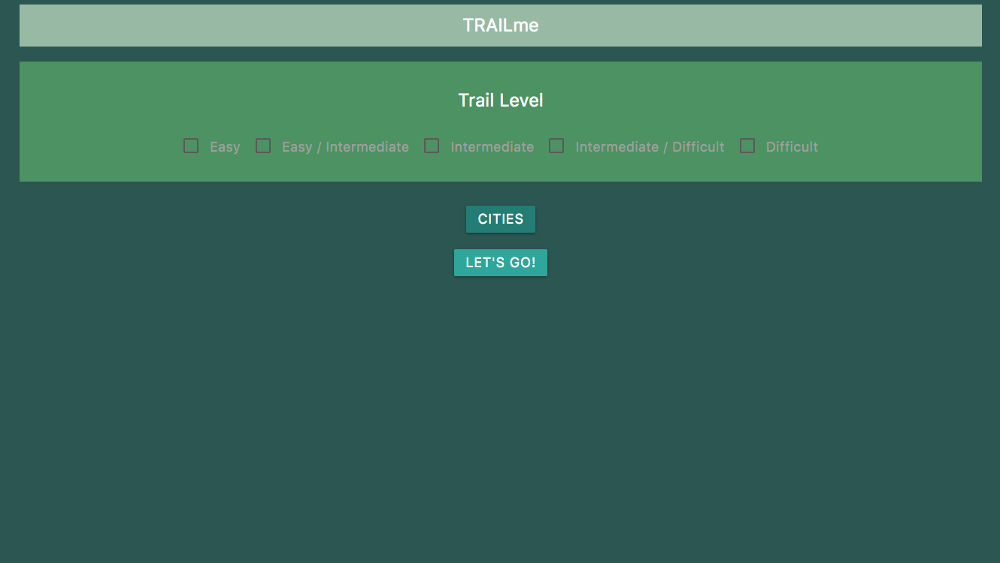
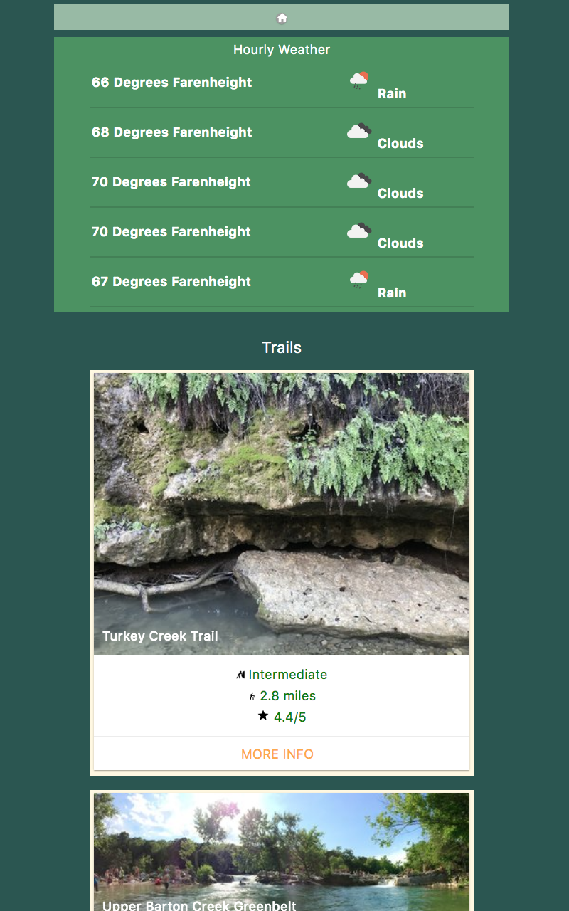

# TRAILme-App

## Value Add Proposal

An app that:

- Allows hikers to find hiking trails in their city at their desire difficulty level.

## MVP

- User criteria, select city and level of difficulty for hiking trails.
- Populate trails based on criteria with image.
- Display hourly forecast for city selected.

## Tech Stack & Tools

- Node.js
- jQuery
- Materalized
- APIs

## API list

| Provider       |
| -------------- |
| Hiking Project |
| OpenWeather    |

## Preview

 

## Links

[Go to App!](https://group-3-project-1.github.io/Trailme-Locator/)
